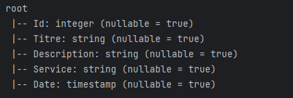
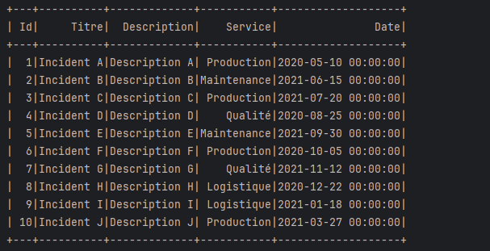
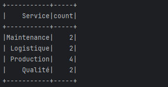
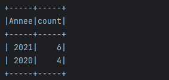

# Analyse des Incidents par Service avec Apache Spark

## Description du Projet-DEMO

Nous souhaitons développer pour une entreprise industrielle une application Spark qui traite les incidents de chaque service. Les incidents sont stockés dans un fichier CSV.

Le format de données dans les fichiers CSV est le suivant :

```
Id, titre, description, service, date
```

### Travail à Faire

1. **Afficher le nombre d’incidents par service.**
2. **Afficher les deux années où il y a eu le plus d’incidents.**

---

## Étapes de Développement

### 1. Préparation de l'Environnement

- **Technologies Utilisées :**
    - Java
    - Apache Spark
    - Maven

- **Configuration du Projet :**

    - Création d'un projet Maven.
    - Ajout des dépendances nécessaires dans le `pom.xml` :

      ```xml
      <dependencies>
          <!-- Spark Core -->
          <!-- https://mvnrepository.com/artifact/org.apache.spark/spark-core -->
          <dependency>
              <groupId>org.apache.spark</groupId>
              <artifactId>spark-core_2.13</artifactId>
              <version>3.3.1</version>
          </dependency>
      
          <!-- Spark SQL -->
          <!-- https://mvnrepository.com/artifact/org.apache.spark/spark-sql -->
          <dependency>
              <groupId>org.apache.spark</groupId>
              <artifactId>spark-sql_2.13</artifactId>
              <version>3.3.1</version>
          </dependency>
      </dependencies>
      ```

### 2. Création du Fichier CSV

- Création d'un fichier nommé `incidents.csv` avec le contenu suivant :

  ```csv
  Id,Titre,Description,Service,Date
  1,Incident A,Description A,Production,2020-05-10
  2,Incident B,Description B,Maintenance,2021-06-15
  3,Incident C,Description C,Production,2021-07-20
  4,Incident D,Description D,Qualité,2020-08-25
  5,Incident E,Description E,Maintenance,2021-09-30
  6,Incident F,Description F,Production,2020-10-05
  7,Incident G,Description G,Qualité,2021-11-12
  8,Incident H,Description H,Logistique,2020-12-22
  9,Incident I,Description I,Logistique,2021-01-18
  10,Incident J,Description J,Production,2021-03-27
  ```

### 3. Développement de l'Application Spark

#### a. Lecture du Fichier CSV

- Lecture du fichier en utilisant Spark :

  ```java
  Dataset<Row> df = spark.read()
          .option("header", "true")
          .option("inferSchema", "true")
          .csv("incidents.csv");
  ```

#### b. Affichage du Schéma du DataFrame

- Affichage du schéma pour vérifier la structure des données :

  ```java
  df.printSchema();
  ```

  

#### c. Affichage des Données du DataFrame

- Affichage des premières lignes du DataFrame :

  ```java
  df.show();
  ```

  

#### d. Traitement des Données

##### **1. Afficher le Nombre d’Incidents par Service**

- Groupement par le champ `Service` et comptage des incidents :

  ```java
  Dataset<Row> incidentsParService = df.groupBy("Service").count();
  incidentsParService.show();
  ```

- Résultat :

  

##### **2. Afficher les Deux Années avec le Plus d’Incidents**

- Conversion de la colonne `Date` en format date et extraction de l'année :

  ```java
  Dataset<Row> dfAvecDate = df.withColumn("Date", functions.to_date(df.col("Date"), "yyyy-MM-dd"));
  Dataset<Row> dfAvecAnnee = dfAvecDate.withColumn("Annee", functions.year(dfAvecDate.col("Date")));
  ```

- Groupement par année et comptage des incidents :

  ```java
  Dataset<Row> incidentsParAnnee = dfAvecAnnee.groupBy("Annee").count();
  Dataset<Row> topAnnees = incidentsParAnnee.orderBy(functions.col("count").desc()).limit(2);
  topAnnees.show();
  ```

- Résultat :

  

### 4. Code Complet

```java
package ma.enset;

import org.apache.spark.sql.Dataset;
import org.apache.spark.sql.Row;
import org.apache.spark.sql.SparkSession;
import org.apache.spark.sql.functions;

public class AnalyseIncidents {
    public static void main(String[] args) {
        // Initialiser la session Spark
        SparkSession spark = SparkSession.builder()
                .appName("Analyse des Incidents")
                .master("local[*]")
                .getOrCreate();

        // Lire le fichier CSV dans un DataFrame
        Dataset<Row> df = spark.read()
                .option("header", "true")   // Le fichier CSV contient un en-tête
                .option("inferSchema", "true") // Inférer le schéma automatiquement
                .csv("incidents.csv");

        // Afficher le schéma du DataFrame
        df.printSchema();

        // Afficher les données du DataFrame
        df.show();

        // **1. Afficher le nombre d’incidents par service**
        Dataset<Row> incidentsParService = df.groupBy("Service").count();
        System.out.println("Nombre d'incidents par service :");
        incidentsParService.show();

        // **2. Afficher les deux années avec le plus d’incidents**
        Dataset<Row> dfAvecDate = df.withColumn("Date", functions.to_date(df.col("Date"), "yyyy-MM-dd"));
        Dataset<Row> dfAvecAnnee = dfAvecDate.withColumn("Annee", functions.year(dfAvecDate.col("Date")));
        Dataset<Row> incidentsParAnnee = dfAvecAnnee.groupBy("Annee").count();
        Dataset<Row> topAnnees = incidentsParAnnee.orderBy(functions.col("count").desc()).limit(2);
        System.out.println("Les deux années avec le plus d'incidents :");
        topAnnees.show();

        // Arrêter la session Spark
        spark.stop();
    }
}
```

---

## Résultats Obtenus

### **1. Nombre d'Incidents par Service**

En exécutant le code, nous obtenons le nombre d'incidents par service :


### **2. Les Deux Années avec le Plus d’Incidents**

Le programme affiche les deux années avec le plus grand nombre d'incidents :


---
